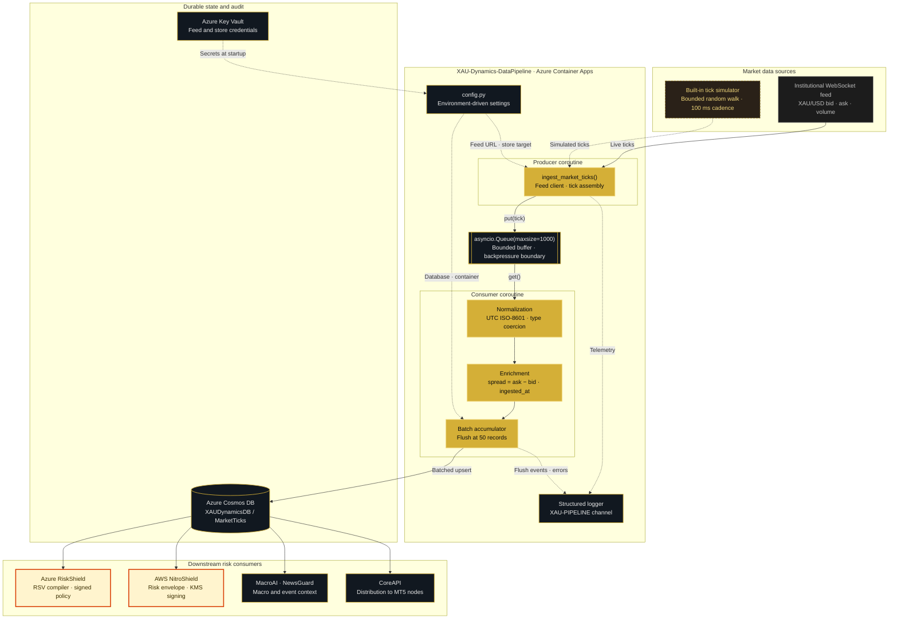
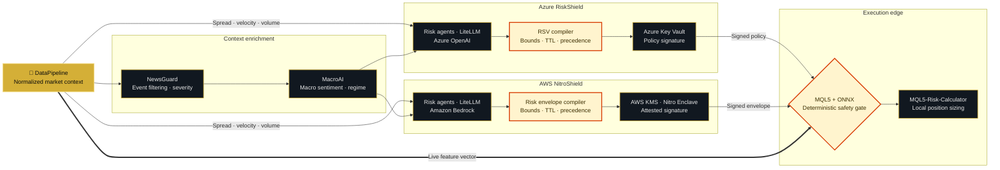

<div align="center">


# 🥇 XAU-Dynamics-DataPipeline

### ⚡ Market Data Ingestion & Normalization Layer · XAU Dynamics Platform

**Raw ticks in. Structured market context out. Every downstream risk decision starts here.**

[](https://www.python.org/)
[](https://docs.python.org/3/library/asyncio.html)
[](https://azure.microsoft.com/products/container-apps)
[](https://azure.microsoft.com/products/cosmos-db)

[](https://www.docker.com/)
[](#)
[](#-implementation-status)
[](#-license)

> The ingestion tier of the XAU Dynamics risk platform. It captures high-frequency XAU/USD market data,
> normalizes and enriches it into a stable schema, and streams it to durable storage so that
> **Azure RiskShield** and **AWS NitroShield** can compile enforceable risk policy from clean inputs.

[Summary](#-executive-summary) · [Status](#-implementation-status) · [Architecture](#-architecture) · [Features](#-system-features) · [Ecosystem](#-ecosystem-fit) · [Configuration](#-configuration) · [Deployment](#-deployment)

</div>

---

## 📌 Executive summary

Deterministic risk enforcement is only as good as the market context it is given. A safety gate that
resizes or rejects an order needs to know the **current spread, price velocity, and volume profile** — and it
needs that information as a clean, timestamped, schema-stable record, not as an ad-hoc feed read differently
by every consumer.

`XAU-Dynamics-DataPipeline` is that single source of market truth. It is a small, deliberately narrow
microservice with one responsibility: **turn a raw XAU/USD tick stream into normalized, enriched, durable
records at high throughput without ever blocking.**

It is intentionally **not** a strategy, a signal generator, or a decision maker. It does not size positions,
does not place orders, and holds no execution authority. That separation is the same architectural discipline
that governs the rest of the platform: this service produces facts, the shield services produce policy, and
the local MQL5 gate is the only component permitted to approve an order.

| Dimension | Design |
|---|---|
| Role in platform | Upstream ingestion and normalization tier |
| Instrument | XAU/USD (architecture is instrument-agnostic) |
| Concurrency model | Single-process `asyncio` producer/consumer over a bounded queue |
| Transport in | WebSocket market feed |
| Transport out | Batched writes to Azure Cosmos DB (`MarketTicks` container) |
| Compute target | Azure Container Apps (containerized, horizontally scalable) |
| Authority | None — read and publish only. No order path, no policy signing. |
| Consumers | `Azure-RiskShield`, `AWS-NitroShield`, `MacroAI`, `NewsGuard`, `CoreAPI` |

---

## 🧭 Implementation status

This repository is an **honest reference implementation**: the concurrency architecture, schema, and
containerization are real and runnable today, while the two external integrations run against a built-in
simulator so the service can be developed and load-tested without live credentials or market hours.

| Component | Status | Detail |
|---|:--:|---|
| Async producer/consumer topology | ✅ Implemented | `asyncio.gather` over a bounded `asyncio.Queue(maxsize=1000)` |
| Bounded backpressure buffer | ✅ Implemented | Queue saturation blocks the producer rather than growing memory |
| Tick normalization & enrichment | ✅ Implemented | Derived `spread`, UTC ISO-8601 `timestamp` and `ingested_at` |
| Batch accumulation | ✅ Implemented | Flush threshold of 50 records |
| Structured logging | ✅ Implemented | `%(asctime)s \| %(levelname)s \| XAU-PIPELINE \| %(message)s` |
| Per-loop fault isolation | ✅ Implemented | Each coroutine catches, logs, and backs off without killing the peer |
| Environment-driven config | ✅ Implemented | `config.py`, 12-factor, no secrets in source |
| Container image | ✅ Implemented | `python:3.10-slim`, dependency layer cached ahead of source |
| Live WebSocket feed client | 🟡 Simulated | `ingest_market_ticks()` generates a bounded random walk from a 2350.00 base |
| Cosmos DB writer | 🟡 Simulated | Flush path is `await asyncio.sleep(0.05)` standing in for network I/O |
| Managed identity auth | ⬜ Planned | Replace key-based access with a Container Apps managed identity |
| Graceful shutdown flush | ⬜ Planned | Partial batches are currently discarded on `KeyboardInterrupt` |
| Automated tests | ⬜ Planned | No test suite in the repository yet |

> [!NOTE]
> The simulator is a feature, not a placeholder apology. It produces a deterministic, tunable tick load,
> which is what makes throughput measurement, queue-saturation testing, and downstream replay possible
> before a broker feed is attached. Swapping it for a live client changes one coroutine and nothing else —
> the queue contract, schema, and consumers are unaffected.

---

## 🏗️ Architecture



*Solid arrows carry market data. Dotted arrows carry configuration, secrets, and telemetry.*

### 🔄 Ingestion flow, stage by stage

1. **Connect.** `ingest_market_ticks()` opens the feed identified by `GOLD_FEED_URL`. In the current build a
   bounded random walk stands in for the socket, emitting a tick every **100 ms** (~10 ticks/sec/instrument).
2. **Assemble.** Each tick becomes a flat dict: `symbol`, `bid`, `ask`, `timestamp`, `volume`. Bid and ask are
   derived symmetrically around the mid, so the schema is identical whether the source is live or simulated.
3. **Enqueue with backpressure.** The tick is pushed onto a queue capped at **1,000 records**. This cap is the
   safety property that matters: if the consumer stalls, `await queue.put()` blocks the producer instead of
   letting an unbounded buffer consume the container's memory until the platform kills it.
4. **Normalize.** The consumer coerces types and stamps `ingested_at` in UTC ISO-8601, giving every record two
   independent clocks — venue time and pipeline time — so ingestion lag is measurable after the fact.
5. **Enrich.** `spread = ask − bid` is computed once, at ingestion, to four decimal places. Every downstream
   consumer reads the same number rather than recomputing it from raw quotes with its own rounding rules.
6. **Batch.** Records accumulate to a threshold of **50** before a single write is issued — roughly one flush
   every 5 seconds at the simulated rate. Batching is what keeps request-unit consumption and per-write
   overhead flat as tick volume rises.
7. **Persist.** The batch is written to the `MarketTicks` container in Cosmos DB and the buffer is cleared.
8. **Isolate faults.** Both coroutines wrap their loop body in `try/except`, log the failure, and back off. A
   transient error in the consumer cannot terminate the producer, and vice versa.

---

## ⚙️ System features

| Capability | Implementation | Why it matters |
|---|---|---|
| **Non-blocking ingestion** | `asyncio` producer/consumer, no threads, no locks | A slow write never stalls tick capture; the two paths advance independently |
| **Bounded backpressure** | `asyncio.Queue(maxsize=1000)` | Converts an unbounded memory leak into a visible, testable stall condition |
| **Schema stability** | Fixed tick contract, enriched in one place | Consumers never parse vendor-specific payloads or re-derive spread |
| **Dual timestamps** | Venue `timestamp` + pipeline `ingested_at` | Ingestion lag becomes an auditable measurement, not an assumption |
| **Write amortization** | 50-record batch flush | Keeps Cosmos DB request units and per-call overhead flat under load |
| **Fault isolation** | Per-coroutine `try/except` with back-off | One transient failure degrades throughput instead of ending the service |
| **12-factor configuration** | `os.getenv` with safe defaults in `config.py` | Same image promotes from local to staging to production unchanged |
| **No secrets in source** | Placeholder defaults only; real values injected at runtime | The repository is safe to keep public |
| **Deterministic load generation** | Built-in tick simulator | Reproducible throughput and saturation tests without market hours |
| **Single-channel logging** | Named `XAU-PIPELINE` log channel | Clean filtering in Azure Monitor / Log Analytics |
| **Immutable container** | `python:3.10-slim`, deps layered before source | Fast rebuilds, small attack surface, reproducible deploys |
| **Horizontal scale unit** | One container per instrument or shard | Capacity grows by replica count, not by process complexity |

### 📊 Throughput profile

Figures below are the **configured** characteristics of the current build, derived directly from the
constants in `pipeline.py`. They describe the simulator's cadence, not a claim about a live venue.

| Property | Value | Source |
|---|---|---|
| Tick interval | 100 ms | `await asyncio.sleep(0.1)` |
| Nominal ingest rate | ~10 ticks/sec/instrument | Derived from interval |
| Queue capacity | 1,000 records | `asyncio.Queue(maxsize=1000)` |
| Buffer depth at nominal rate | ~100 seconds of ticks | Capacity ÷ rate |
| Batch flush threshold | 50 records | `batch_limit = 50` |
| Flush cadence at nominal rate | ~1 write / 5 seconds | Threshold ÷ rate |
| Simulated write latency | 50 ms | Stand-in for Cosmos round trip |
| Error back-off | 1 second per coroutine | Exception handler in each loop |
| Feed reconnect delay (configured) | 5 seconds | `RETRY_DELAY_SECONDS` in `config.py` |

### 🧾 Record schema

Every document written to the `MarketTicks` container has this shape:

```json
{
  "symbol": "XAUUSD",
  "bid": 2349.85,
  "ask": 2350.15,
  "spread": 0.3,
  "volume": 87,
  "timestamp": "2026-08-29T17:32:04.061000Z",
  "ingested_at": "2026-08-29T17:32:04.812000Z"
}
```

---

## 🔗 Ecosystem fit

This service sits at the **head** of the XAU Dynamics platform. Both shield products are enforcement engines,
and an enforcement engine is only trustworthy if its inputs are clean, timestamped, and identical across
clouds. That is precisely the contract this pipeline provides.



### 🛡️ What each consumer takes from this pipeline

| Consumer | Field consumed | How it is used |
|---|---|---|
| **[Azure RiskShield](https://github.com/XAUDynamics-Labs/XAU-Dynamics-Azure-RiskShield)** | `spread`, `bid`/`ask` velocity, `volume` | Feeds the market-quality inputs the Risk State Vector compiler needs to set spread and slippage thresholds and to justify a `WATCH` → `REDUCE` → `FREEZE` escalation |
| **[AWS NitroShield](https://github.com/XAUDynamics-Labs/XAU-Dynamics-AWS-NitroShield)** | `spread`, realized volatility, `volume` | Supplies the volatility-regime evidence behind `position_sizing_ceiling` and `execution_state` in the signed risk envelope |
| **MT5 safety gate (MQL5 + ONNX)** | Live tick features | Forms part of the in-process feature vector evaluated on every proposed order, inside the sub-millisecond local budget |
| **[MacroAI](https://github.com/XAUDynamics-Labs/XAU-Dynamics-MacroAI)** | Price reaction windows around events | Correlates macro sentiment with the market response that actually followed |
| **[NewsGuard](https://github.com/XAUDynamics-Labs/XAU-Dynamics-NewsGuard)** | Pre- and post-release tick behaviour | Calibrates event severity against realized spread expansion rather than calendar labels |
| **[CoreAPI](https://github.com/XAUDynamics-Labs/XAU-Dynamics-CoreAPI)** | Normalized tick stream | Distributes a consistent view to connected execution nodes |
| **[MQL5-Risk-Calculator](https://github.com/XAUDynamics-Labs/MQL5-Risk-Calculator)** | `spread`, `bid`, `ask` | Sizes positions against real quoted cost instead of a static assumption |

### 🧱 Why the boundary is drawn here

Three properties make this separation worth the extra service:

**One definition of spread.** Computed once, at ingestion. If RiskShield and NitroShield each derived it from
raw quotes, the two clouds could disagree about market quality during the exact window where agreement
matters most — and a signed policy built on a disputed input is not auditable.

**Cloud-neutral inputs.** The record schema contains no Azure or AWS concept. The same normalized tick feeds
an Azure Key Vault-signed Risk State Vector and an AWS KMS-signed envelope without translation, which is what
makes the multi-cloud posture genuine rather than a duplicated codebase.

**A compounding corpus.** Every persisted record is one row of the event → context → outcome dataset that both
proposals identify as the platform's durable moat. Historical market conditions cannot be re-observed later,
so the pipeline's real long-term output is an asset that only this service can accumulate.

> [!IMPORTANT]
> This pipeline has **no execution authority**. It publishes observations. Only the local MQL5 gate may
> approve, resize, or reject an order — and it does so against a cryptographically signed policy, never
> against a raw feed. A failure here degrades context freshness; it can never authorize new risk.

---

## 📂 Repository structure

```text
XAU-Dynamics-DataPipeline/
├── pipeline.py          # XAUDatapipeline: producer, consumer, and orchestration
├── config.py            # Environment-driven settings and logger configuration
├── requirements.txt     # Runtime dependencies
├── Dockerfile           # python:3.10-slim container image
└── README.md            # This document
```

| File | Responsibility |
|---|---|
| `pipeline.py` | Defines the service class with `ingest_market_ticks()`, `process_and_store()`, and `run()`, which launches both coroutines under `asyncio.gather` |
| `config.py` | Resolves every setting through `os.getenv` with a safe default, and configures the shared `XAU-PIPELINE` log channel |
| `requirements.txt` | `azure-cosmos`, `websockets`, `pandas`, `numpy` |
| `Dockerfile` | Installs dependencies in a cached layer, then copies source; entrypoint is `python pipeline.py` |

---

## 🔐 Configuration

All settings resolve through `config.py`. Every value has a non-secret default so the service starts cleanly
out of the box, and every value is overridable by environment variable so the same image promotes unchanged
from a laptop to production.

| Variable | Purpose | Default | Production source |
|---|---|---|---|
| `AZURE_COSMOS_URI` | Cosmos DB account endpoint | `https://xau-dynamics-db.documents.azure.com:443/` | Container Apps environment variable |
| `AZURE_COSMOS_KEY` | Cosmos DB access key | Non-functional placeholder string | **Azure Key Vault secret reference** |
| `GOLD_FEED_URL` | XAU/USD WebSocket endpoint | `wss://stream-api.xau-dynamics.io/v3/gold` | Container Apps environment variable |

Two settings are compile-time constants rather than environment variables, because they define the storage
contract that downstream consumers query against and should not drift per environment:

| Constant | Value |
|---|---|
| `DATABASE_NAME` | `XAUDynamicsDB` |
| `CONTAINER_NAME` | `MarketTicks` |
| `RETRY_DELAY_SECONDS` | `5` |

> [!WARNING]
> `AZURE_COSMOS_KEY` ships with a deliberately non-functional placeholder so that no credential ever enters
> version control. Never replace it with a real key in source. Inject it as a Key Vault secret reference, or
> better, remove key-based auth entirely in favour of a managed identity (see [Roadmap](#-roadmap)).

### Local `.env`

```dotenv
AZURE_COSMOS_URI=https://<your-account>.documents.azure.com:443/
AZURE_COSMOS_KEY=<injected-at-runtime-never-committed>
GOLD_FEED_URL=wss://<your-feed-host>/v3/gold
```

---

## 💻 Local quick start

**Prerequisites:** Python 3.10+ or Docker. No Azure subscription is required to run the service, because the
built-in simulator supplies the tick stream.

### Option A — Native Python

```bash
git clone https://github.com/XAUDynamics-Labs/XAU-Dynamics-DataPipeline.git
cd XAU-Dynamics-DataPipeline
```

```bash
python -m venv .venv && source .venv/bin/activate
```

On Windows PowerShell, activate with `.venv\Scripts\Activate.ps1` instead.

```bash
pip install -r requirements.txt
```

```bash
python pipeline.py
```

Expected output — the initialization banner, the resolved feed URL, the Cosmos target, then a flush line every
50 ticks (roughly every 5 seconds):

```text
2026-08-29 17:32:01,004 | INFO | XAU-PIPELINE | Initializing XAU Dynamics Data Pipeline Engine...
2026-08-29 17:32:01,006 | INFO | XAU-PIPELINE | Connecting to live gold price feed at: wss://stream-api.xau-dynamics.io/v3/gold
2026-08-29 17:32:01,007 | INFO | XAU-PIPELINE | Establishing connection with Azure Cosmos Container: XAUDynamicsDB/MarketTicks
2026-08-29 17:32:06,112 | INFO | XAU-PIPELINE | Streaming batch of 50 normalized ticks to Azure Cosmos DB.
2026-08-29 17:32:11,167 | INFO | XAU-PIPELINE | Streaming batch of 50 normalized ticks to Azure Cosmos DB.
```

Stop with `Ctrl+C`; the service logs `Pipeline stopped by operator.` and exits.

To watch individual ticks, lower the log level to `DEBUG` in `config.py` — `ingest_market_ticks()` emits a
`logger.debug` line per tick.

### Option B — Docker

```bash
docker build -t xau-data-pipeline:latest .
```

```bash
docker run --rm --name xau-pipeline --env-file .env xau-data-pipeline:latest
```

Run detached and follow the log stream instead:

```bash
docker run -d --name xau-pipeline --env-file .env xau-data-pipeline:latest && docker logs -f xau-pipeline
```

---

## 🚀 Deployment

Target platform is **Azure Container Apps** — chosen because this workload is a long-running consumer with no
inbound HTTP surface, needs to scale on queue and CPU pressure during news windows, and must reach Cosmos DB
over private networking with a managed identity rather than an embedded key.

### 1 · Build and push to Azure Container Registry

```bash
az acr build --registry <acr-name> --image xau-data-pipeline:v1 .
```

### 2 · Provision the Cosmos DB container

```bash
az cosmosdb sql container create --account-name <cosmos-account> --resource-group <rg> --database-name XAUDynamicsDB --name MarketTicks --partition-key-path /symbol --throughput 400
```

Partition on `/symbol`. It is the field every downstream query filters on, and it keeps the platform's
expansion to additional instruments a matter of new partition keys rather than a schema migration.

### 3 · Store the credential in Key Vault

```bash
az keyvault secret set --vault-name <vault-name> --name cosmos-primary-key --value <primary-key>
```

### 4 · Deploy the container app

```bash
az containerapp create --name xau-data-pipeline --resource-group <rg> --environment <aca-environment> --image <acr-name>.azurecr.io/xau-data-pipeline:v1 --min-replicas 1 --max-replicas 1 --cpu 0.5 --memory 1.0Gi --secrets cosmos-key=keyvaultref:<vault-uri>/secrets/cosmos-primary-key,identityref:system --env-vars AZURE_COSMOS_URI=<cosmos-uri> AZURE_COSMOS_KEY=secretref:cosmos-key GOLD_FEED_URL=<feed-url>
```

### 5 · Grant the managed identity data access

```bash
az cosmosdb sql role assignment create --account-name <cosmos-account> --resource-group <rg> --scope "/" --principal-id <containerapp-principal-id> --role-definition-id 00000000-0000-0000-0000-000000000002
```

### ⚠️ Scaling model — one replica per instrument shard

Note the `--max-replicas 1` above. It is deliberate, and it is the most important operational property of this
service.

This is an **ingester**, not a request handler. Each replica opens its own feed connection, so running two
replicas of the same shard does not double throughput — it writes every tick twice. Duplicate ticks would
inflate volume, corrupt any realized-volatility calculation derived from the corpus, and feed a distorted
market-quality picture into a policy that gets cryptographically signed and enforced against a live account.

The correct scale unit is therefore **one replica per instrument or feed shard**, not a replica pool behind an
autoscaler:

| Requirement | Correct pattern |
|---|---|
| Add an instrument | Deploy an additional container app with its own `GOLD_FEED_URL` and shard identity |
| Survive a replica failure | Container Apps replaces the single replica; a bounded gap in context is safe by design |
| Absorb a news-window burst | Raise CPU/memory for the replica and let the bounded queue absorb the spike |
| Guarantee exactly-once ingestion | A lease record in Cosmos DB, mirroring the execution-lease pattern used by the shield services |

This is the same reasoning that rules out load-balancing live MT5 terminals in `AWS-NitroShield`: for anything
that writes to a system of record, parallel capacity is a correctness bug, not a performance feature.

### 📈 Observability

Container Apps forwards the `XAU-PIPELINE` log channel to Log Analytics. The signals worth alerting on:

| Signal | Query target | Why it matters |
|---|---|---|
| Flush cadence | Frequency of `Streaming batch of N` lines | A widening gap means the consumer is falling behind |
| Ingestion lag | `ingested_at` − `timestamp` per record | The direct measure of whether context is fresh enough to trust |
| Error rate | `ERROR` lines per coroutine | Distinguishes a feed problem from a write problem |
| Queue saturation | Producer stall duration | The early warning that precedes any data loss |

---

## 🗺️ Roadmap

Ordered by what most increases the trustworthiness of downstream policy.

| Priority | Item | Rationale |
|:--:|---|---|
| 1 | Replace the simulator with a live `websockets` client, retrying on `RETRY_DELAY_SECONDS` with jitter | Turns the reference implementation into a production feed |
| 2 | Real `azure-cosmos` batched upsert with retry on HTTP 429 | Cosmos throttling under news load must degrade gracefully, not silently drop batches |
| 3 | Graceful shutdown that flushes the partial batch | Today a `Ctrl+C` discards up to 49 buffered ticks |
| 4 | Managed identity in place of `AZURE_COSMOS_KEY` | Removes the last long-lived credential from the service |
| 5 | Time-based flush alongside the size threshold | A quiet market currently leaves records buffered until 50 accumulate |
| 6 | Cosmos DB ingestion lease for exactly-once guarantees | Makes duplicate ingestion structurally impossible rather than procedurally avoided |
| 7 | `pytest` suite over normalization, enrichment, and queue saturation | The enrichment maths feeds signed policy and deserves regression cover |
| 8 | Migrate `datetime.utcnow()` → `datetime.now(timezone.utc)` | `utcnow()` is deprecated from Python 3.12; the badge claims 3.10+ |
| 9 | Trim `requirements.txt` to what is imported | `pandas` and `numpy` are declared but unused, inflating the image |
| 10 | Non-root `USER` and a `.dockerignore` in the image | Standard container hardening ahead of any security review |
| 11 | Prometheus/OpenTelemetry counters for rate, lag, and depth | Moves observability from log parsing to first-class metrics |
| 12 | Rename the class `XAUDatapipeline` → `XAUDataPipeline` | PEP 8 CapWords; the current casing reads as a typo in review |

---

## ⚖️ Responsible scope

This is data infrastructure. It is not investment advice, not a trading signal, and not a guarantee of broker
fills or execution quality. It observes and records market data so that the enforcement layers above it can
apply configured limits consistently and produce auditable evidence that those limits were applied. No
component in this repository can open, size, or approve a position.

---

## 📄 License

Proprietary. © 2026 XAU Dynamics Labs. All rights reserved.

---

<div align="center">

**XAU DYNAMICS**

*Clean data in. Deterministic safety out.*

[](https://github.com/XAUDynamics-Labs/XAU-Dynamics-Azure-RiskShield)
[](https://github.com/XAUDynamics-Labs/XAU-Dynamics-AWS-NitroShield)
[](https://www.linkedin.com/in/marwan-sekhri)

</div>
